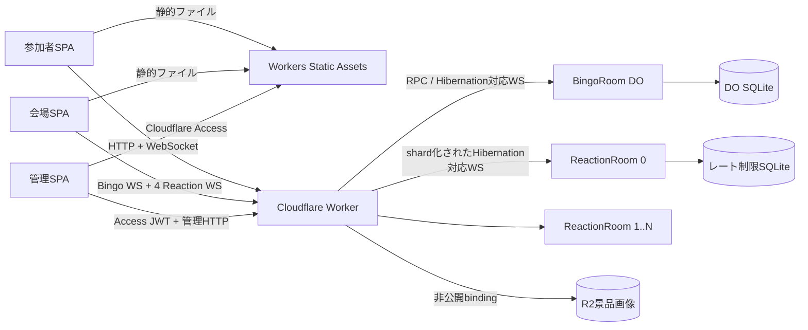

# アーキテクチャ

## 目標

- 年1回、4時間のイベントで500〜1,000人の同時参加者に対応する
- リアクションや任意機能を停止した場合でも、番号表示を継続できる
- Cloudflare Freeプラン内での運用を目標とする
- 常時稼働するオリジンサーバー、コンテナ、トンネル、外部データベースを使用しない

## コンポーネント

### 静的フロントエンド

Viteで1つのReact SPAをビルドします。Workers Static Assetsでは`not_found_handling: single-page-application`を使用し、`run_worker_first`には`/api/*`だけを指定します。一致する静的ファイルはWorkerコードを起動せずに配信されます。

ルート:

- `/`: 参加者向けの番号表示、並び順切り替え、言語、テーマ、リーチ、アンケート、リアクション
- `/prizes`: リアルタイム景品一覧
- `/screen`: 会場向け番号表示、リーチ数、Matter.jsによるリアクションアニメーション
- `/admin`: 管理画面。Cloudflare Accessでこのパスを外部から保護する必要があります

### Worker API

`src/worker/index.ts`が唯一の動的な入口です。次の処理を担当します。

- 署名済み`bingo_client` Cookieの発行と検証
- 同一オリジンからの書き込みであることの検証
- Access JWTの署名、issuer、audience、有効期限の検証
- イベントIDから一意のDurable Object名への対応付け
- SHA-256クライアントハッシュによるリアクションクライアントのshard分割
- R2 bindingを介した景品画像の検証と保存
- bindingを利用できる処理では、プラットフォームのREST APIを使用しない

### BingoRoom

`EVENT_ID`ごとに1インスタンスを使用し、`bingo-room:<eventId>`という名前で識別します。担当する処理は次のとおりです。

- 抽選番号の作成、更新、削除、リセット
- 最新番号とリーチ数
- アンケート状態と機能フラグ
- 景品メタデータと一意に定まる表示順
- 署名済みクライアントごとに1回のリーチ送信
- 信頼できる単調増加version
- 最大256イベントの差分履歴
- Hibernation WebSocket接続とbroadcast

SQLiteテーブル:

- `event_config`
- `live_state`
- `numbers`（`UNIQUE`、`CHECK 1..99`）
- `prizes`
- `reach_submissions`
- `versioned_events`

すべての状態変更、versionの増加、イベント挿入を同一の`transactionSync`内で実行します。トランザクション成功後にだけbroadcastするため、処理途中の状態が配信されることはありません。

### ReactionRoom shard

各インスタンスは`reaction-room:<eventId>:<index>`という名前で、個数は`REACTION_SHARDS`（既定値4）から決まります。参加者は一意に決まる1つのshardへ接続し、会場画面はすべてのshardへ接続します。そのため、リアクショントラフィックがBingoRoomへ入ることはありません。

各shardは次の情報を永続化します。

- `reaction_rate_limits`: クライアントハッシュごとの最終受付時刻
- `global_rate_limits`: 1秒ごとの受付数
- `reaction_config`: 有効・無効状態
- `reaction_budget`: イベント内の受付数

制限:

- クライアントごとに10秒あたり1件まで
- shardごとに1秒あたり最大100件
- shardごとに1イベントあたり最大4,000件
- WebSocket受信メッセージは最大4 KiB
- 拒否または不正なメッセージが3回に達した接続を切断

イベント上限により、全shardの受付数は合計16,000件までに制限されます。上限を消費したshardだけを無効化し、BingoRoomは通常どおり動作を継続します。

## データフロー

### 参加者の初回接続

1. SPAが`GET /api/session`を呼び出します。
2. WorkerがHttpOnlyの署名済みクライアントCookieを検証または発行します。
3. SPAが`/api/ws`をWebSocketへupgradeします。
4. Workerがリクエストを`BingoRoom.fetch()`へ転送します。
5. BingoRoomが`acceptWebSocket()`を使用し、完全なsnapshotを送信します。
6. 以降の変更はversion付きdeltaとして一度だけシリアライズし、すべての接続へ再利用します。

### 管理者による番号更新

1. Cloudflare Accessがedgeでリクエストを認証します。
2. WorkerがAccess JWKSを使用して`Cf-Access-Jwt-Assertion`を独自に検証します。
3. WorkerがOriginとコマンドschemaを検証します。
4. BingoRoomがSQLite transactionを実行し、現在のsnapshotを返します。
5. BingoRoomが`number.added`、`number.updated`、または`number.deleted`をbroadcastします。
6. 参加者と会場のクライアントが、ポーリングせずdeltaを適用します。

### リアクション

1. 参加者が署名済みクライアントハッシュから選ばれたshardへ接続します。
2. ReactionRoomがJSON、許可されたリアクション名、クライアントのクールダウン、全体レート、イベント上限を検証します。
3. 事前にシリアライズした1件の`reaction.batch`を、そのshardの会場購読者へ送信します。
4. BingoRoomは呼び出しません。

### 景品画像

1. 管理者がmultipartデータを`/api/admin/prizes`へ送信します。
2. WorkerがAccessとOriginを検証します。
3. Workerが最大サイズ、宣言されたMIME type、magic bytesを検証します。
4. WorkerがUUIDのkeyを生成し、R2 bindingを介して書き込みます。
5. BingoRoomがメタデータと旧objectの削除予定を同じSQLite transactionでcommitします。
6. commitが失敗した場合、Workerは現在のメタデータが新しいkeyを参照していないことを確認してから、そのkeyを削除outboxへ登録します。commit結果が不明な場合は参照中のobjectを削除しません。
7. 更新、削除、イベント初期化で不要になったobjectは永続outboxから冪等に削除し、失敗時はDurable Object alarmで再試行します。
8. 公開読み取りには`/api/prize-images/<encoded-key>`を使用し、bucket自体は非公開に保ちます。

## 認証境界

- 参加者識別子はログイン情報ではありません。`HttpOnly; Secure; SameSite=Lax`を設定したHMAC署名済みCookieに256-bitのランダムIDを格納し、SQLiteにはSHA-256ハッシュだけを保存します。
- 公開書き込みAPIでは、完全一致するOriginと有効な署名済みCookieが必要です。
- 管理者権限はすべての管理API呼び出しでサーバー側検証します。UIの表示可否を認可として扱いません。
- ローカルバイパスには、`ENVIRONMENT=local`、`DEV_ACCESS_BYPASS=true`、および`DEV_ADMIN_TOKEN`との定数時間比較のすべてが必要です。
- production設定では`DEV_ACCESS_BYPASS=false`にします。

## 障害分離と縮退運転

保護する優先順位は、番号表示、番号管理、会場表示、リーチ、アンケート、リアクションの順です。

- Reaction shardはBingoRoomと状態処理経路を共有しません。
- `reactionsEnabled`はすべてのshardへ反映されます。
- Reaction設定には単調増加するversionを付け、BingoRoomの永続outboxから各shardへ冪等に反映します。部分失敗はalarmで再試行し、`readOnlyMode`も全shardへ伝播します。
- `reachSubmissionEnabled`は参加者からのリーチ送信を停止しますが、管理者によるリーチ操作は継続できます。
- `surveyEnabled`は保存済みURLを削除せずにアンケート案内を非表示にします。
- `adminWritesEnabled`はフラグ更新以外の管理操作を拒否します。
- `readOnlyMode`はリアクションを含むフラグ更新以外の書き込みを拒否しますが、SQLiteからのsnapshotとWebSocket読み取りを継続します。
- Bingo WebSocketとReaction WebSocketには有効な署名済みsession Cookieが必要で、Durable Objectごとに接続上限を適用します。
- WebSocket再接続には指数バックオフとjitterを使用します。version gapまたは初期化payload不整合時は`lastVersion`を送らず、完全snapshotを取得します。
