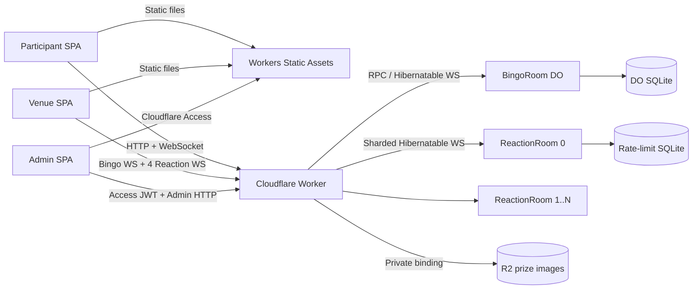

# Architecture

## Goals

- 500–1,000 concurrent participants for one four-hour event per year
- Number display remains available when reactions or optional functions are disabled
- Cloudflare Free plan is the operational target
- No continuously running origin, container, tunnel, or external database

## Components

### Static frontend

Vite builds one React SPA. Worker Static Assets uses `not_found_handling: single-page-application`; `run_worker_first` contains only `/api/*`. A matching static file is served without invoking Worker code.

Routes:

- `/`: participant numbers, order toggle, locale, theme, reach, survey, reactions
- `/prizes`: realtime prize list
- `/screen`: venue number, reach count, Matter.js reaction animation
- `/admin`: management UI; Cloudflare Access must protect this path externally

### Worker API

`src/worker/index.ts` is the sole dynamic ingress. It:

- issues and validates signed `bingo_client` cookies;
- validates same-origin writes;
- verifies Access JWT signature, issuer, audience, and expiration;
- maps event IDs to deterministic Durable Object names;
- shards reaction clients by the SHA-256 client hash;
- validates and stores prize images through the R2 binding;
- never uses platform REST APIs where a binding is available.

### BingoRoom

One instance per `EVENT_ID`, named `bingo-room:<eventId>`. Responsibilities:

- serial number create/update/delete/reset;
- latest number and reach count;
- survey state and feature flags;
- prize metadata and deterministic ordering;
- one reach submission per signed client identity;
- authoritative monotonically increasing version;
- bounded 256-event delta history;
- Hibernation WebSocket connections and broadcast.

SQLite tables:

- `event_config`
- `live_state`
- `numbers` (`UNIQUE`, `CHECK 1..99`)
- `prizes`
- `reach_submissions`
- `versioned_events`

Every state mutation, version increment, and event insert executes inside one `transactionSync`. Broadcast occurs only after the transaction succeeds, so partial state is never published.

### ReactionRoom shards

Instances are named `reaction-room:<eventId>:<index>`, with count from `REACTION_SHARDS` (default 4). Participants deterministically connect to one shard; the venue connects to every shard. Reaction traffic therefore never enters BingoRoom.

Each shard persists:

- `reaction_rate_limits`: last accepted timestamp per client hash;
- `global_rate_limits`: per-second accepted count;
- `reaction_config`: enabled state;
- `reaction_budget`: event accepted count.

Limits:

- one accepted reaction per client per 10 seconds;
- maximum 100 accepted messages/second/shard;
- maximum 4,000 accepted messages/event/shard;
- 4 KiB maximum inbound WebSocket message;
- close after three rejected/invalid messages.

The event cap bounds all shards to 16,000 accepted reactions. Exhausting a shard budget disables that shard; BingoRoom continues normally.

## Data flow

### Initial participant connection

1. SPA calls `GET /api/session`.
2. Worker validates or issues the HttpOnly signed client cookie.
3. SPA upgrades `/api/ws`.
4. Worker forwards to `BingoRoom.fetch()`.
5. BingoRoom uses `acceptWebSocket()` and sends a complete snapshot.
6. Later changes are versioned deltas serialized once and reused for every connection.

### Administrative number update

1. Cloudflare Access authenticates the request at the edge.
2. Worker independently verifies `Cf-Access-Jwt-Assertion` against Access JWKS.
3. Worker validates Origin and command schema.
4. BingoRoom performs the SQLite transaction and returns the current snapshot.
5. BingoRoom broadcasts `number.added`, `number.updated`, or `number.deleted`.
6. Participant and venue clients apply the delta without polling.

### Reaction

1. Participant connects to the shard selected from the signed client hash.
2. ReactionRoom validates JSON, allowed name, client cooldown, global rate, and event budget.
3. It emits one pre-serialized `reaction.batch` to venue subscribers on that shard.
4. No BingoRoom call occurs.

### Prize image

1. Admin submits multipart data to `/api/admin/prizes`.
2. Worker validates Access and Origin.
3. Worker checks maximum size, declared MIME, and magic bytes.
4. Worker generates a UUID key and writes through the R2 binding.
5. BingoRoom commits metadata. On failure, Worker deletes the uploaded object.
6. Update/delete/event initialization remove obsolete objects.
7. Public reads use `/api/prize-images/<encoded-key>`; the bucket remains private.

## Authentication boundaries

- Participant identity is not login. It is a 256-bit random ID in an `HttpOnly; Secure; SameSite=Lax` HMAC-signed cookie; SQLite stores only SHA-256 hashes.
- Public write APIs require exact Origin and a valid signed cookie.
- Admin authorization is server-side on every admin API call. UI visibility is not authorization.
- Local bypass requires all of: `ENVIRONMENT=local`, `DEV_ACCESS_BYPASS=true`, and constant-time comparison with `DEV_ADMIN_TOKEN`.
- Production configuration sets `DEV_ACCESS_BYPASS=false`.

## Failure isolation and degradation

Priority is number display, number administration, venue display, reach, survey, reactions.

- Reaction shards share no state path with BingoRoom.
- `reactionsEnabled` propagates to every shard.
- `reachSubmissionEnabled` disables participant reach while admin reach remains available.
- `surveyEnabled` hides survey prompts without deleting the URL.
- `adminWritesEnabled` rejects non-flag admin mutations.
- `readOnlyMode` rejects writes but continues snapshots and WebSocket reads from SQLite.
- WebSocket reconnect uses exponential backoff and jitter; manual `GET /api/state` is the only HTTP fallback and is never polled automatically.
