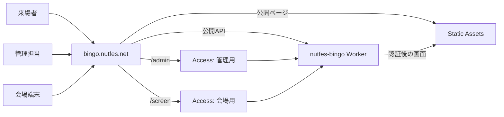
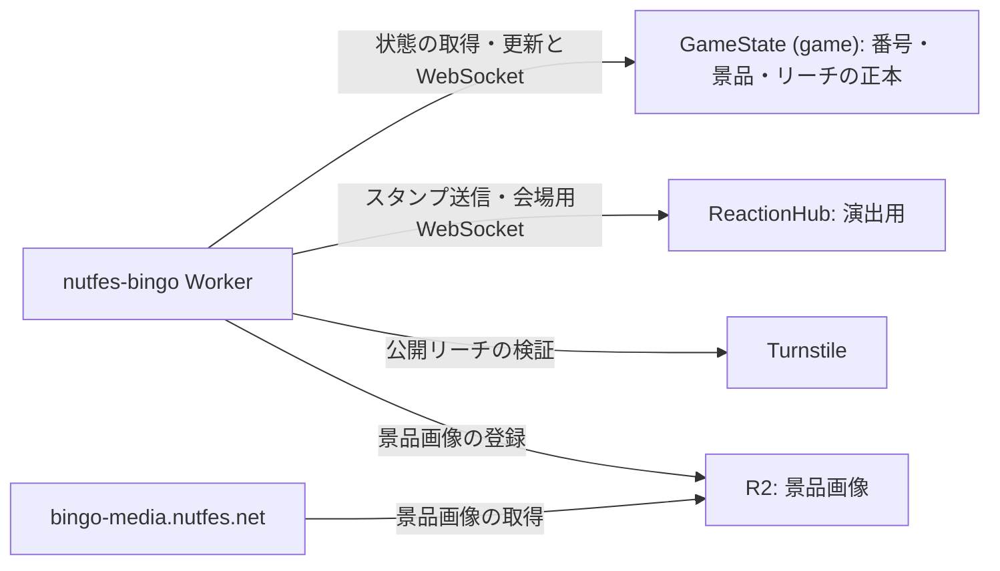

# Cloudflare本番運用

団体のCloudflareアカウントで`nutfes-bingo`を運用する担当者向けの手順です。プロジェクトの開発経験は前提にしません。Git、Docker、Cloudflare Dashboardの基本操作は必要です。初めて担当する場合は「構成」「作業環境」「イベント準備」「デプロイ」を順に読み、以降は必要な章を参照してください。準備の開始日は固定せず、権限の取得やリハーサルに必要な時間を運営側と決めてください。

操作に必要なCloudflareの招待や権限がない場合は、団体アカウントの管理者に依頼します。設定や運用判断がこの文書で解決しない場合は、[リポジトリのIssue](https://github.com/NUTFes/nutfes-Bingo/issues)で開発担当者に確認してください。認証情報やAccessのCookieはIssueに貼らないでください。

## 構成を確認してから作業する

公開画面は`/`と`/prizes/`、管理画面は`/admin`以下、会場画面は`/screen`以下です。まず入口を示し、次にWorkerが呼び出す保存先を示します。両図の矢印は**リクエストの向き**で、返されるデータの向きは省略しています。矢印上の文字は、通る画面・APIや処理の種類です。

公開ページはStatic Assetsから直接配信します。`/admin`と`/screen`は別々のCloudflare Accessアプリケーションを通過した後、WorkerでもJWTを検証します。管理・会場画面のファイルは、その確認後にWorkerからStatic Assetsへ取得しに行きます。



Workerは状態の読み書きとWebSocket接続を`GameState`へ送ります。スタンプ演出は別の`ReactionHub`へ送るため、演出が止まっても番号の正本は保たれます。景品画像はWorkerからR2へ登録し、閲覧時は画像用ドメインから取得します。



管理用・会場用のAccess policyとAUDは別々です。WorkerでもJWTの署名、issuer、AUD、有効期限、`email`、`sub`を確認します。人員の追加・削除はAccess policy（または参照するreusable group）で行い、Workerの再デプロイは不要です。公開状態はWebSocketで配信し、接続できないときは回数制限付きHTTP取得に切り替わります。公開リーチは`/api/bingo/reach`でTurnstileによる検証を受け、スタンプは`/api/bingo/stamps`から`ReactionHub`へ送られます。

| 確認したい内容                                                                       | 設定・実装の正本                                                                                                                            |
| ------------------------------------------------------------------------------------ | ------------------------------------------------------------------------------------------------------------------------------------------- |
| Worker名、団体account ID、Static Assets、DO/R2 binding、migration、保護対象のrouting | `wrangler.jsonc`                                                                                                                            |
| 公開URL、画像URL、Access team/AUD、Turnstile sitekey、共有ownerの識別                | `cloudflare.production.env`（認証情報は含まない）                                                                                           |
| Wrangler secret `TURNSTILE_SECRET_KEY`                                               | 団体CloudflareアカウントのWorker secret。Gitには保存しない                                                                                  |
| 管理・会場画面への所属                                                               | Cloudflare Access applicationのpolicy / reusable group                                                                                      |
| 本番の処理                                                                           | `worker/index.ts`、`worker/game-state.ts`、`worker/reaction-hub.ts`                                                                         |
| ローカル実行と本番リリース                                                           | `mise.toml`、`scripts/cloudflare-dev.sh`、`scripts/preflight-cloudflare.sh`、`scripts/deploy-cloudflare.sh`、`scripts/cloudflare-smoke.mjs` |

`wrangler.jsonc`のDO migrationは`GameState`と`ReactionHub`を作る`v1`です。番号・景品・当選状態・reach・survey・監査記録の正本は固定名`game`のSQLite Durable Object 1個です。景品画像だけをR2に保存します。画像アップロード時には5 MiB上限、MIME、実データの形式、content-hash keyを検査します。DOの世代切替、論理スナップショット、専用バックアップbucket、常設stagingはありません。短期のデータ復旧はSQLite DOのPITR（ある時点への復元）を使います。

## 作業環境とCLIを用意する

ローカルにはGit、[mise](https://mise.jdx.dev/getting-started.html)、[Docker Engine](https://docs.docker.com/engine/install/)（`docker buildx`を含む）を用意します。Docker daemonに接続できることも確認してください。WSLの場合はDockerがそのディストリビューションから使える状態にします。Node `26.2.0`とpnpm `11.2.2`は`mise.toml`で固定しています。Wrangler `4.123.0`は`package.json`の開発依存で、グローバルインストールは不要です。

```bash
git clone https://github.com/NUTFes/nutfes-Bingo.git
cd nutfes-Bingo
git switch develop
mise trust
mise install
mise run install
docker info
pnpm exec wrangler --version
```

リリース担当者は団体Cloudflareアカウントへ個人名義で招待され、MFAとWorkers Scripts書き込み権限を持つ必要があります。共有ownerアカウントや匿名API tokenでは運用スクリプトが止まります。ブラウザで次のログインを完了してから、検証を実行してください。

```bash
pnpm exec wrangler login
./scripts/check-cloudflare-operator.sh
```

検証は`wrangler.jsonc`のaccount IDとの所属一致、個人のログイン、Workers Scripts書き込み権限を確認します。失敗したら団体アカウントの管理者に所属と権限を確認し、別アカウントへデプロイして解決しないでください。`CLOUDFLARE_API_TOKEN`が環境にあるとOAuthログインより優先されるため、この運用では使いません。ブラウザからローカルの認証画面に接続できない場合は`pnpm exec wrangler login --device`を使います。詳細は[CloudflareのWrangler login資料](https://developers.cloudflare.com/workers/wrangler/commands/general/#login)を参照してください。

ローカル表示を確認するときは`mise run cloudflare:dev`を起動し、`http://localhost:8787`を開きます。ビルド済み成果物を確認する場合は別途`mise run cloudflare:preview`を使います。両者は同じポートを使うので同時には起動しません。Viteのclient/WorkerビルドとCloudflare開発runtimeはDocker内で動かします。ホストで`pnpm dev`や`pnpm build`を実行しないでください。ローカルのTurnstileはテストキーで、本番のAccessやTurnstile確認の代わりにはなりません。

## イベントに向けて準備する

既存の本番環境がある場合は次を確認します。初回構築やリソース消失時は、先に「リソース消失・初回構築時だけ作成する」でリソースとWorkerを用意し、その後この章で利用者や当年のデータを整えてください。

1. 主担当と代行担当がそれぞれ個人名義でCloudflareへログインでき、MFAとrecovery contactを利用できることを確認する。`develop`がremote defaultで、required CI、force-push/delete禁止を持つことも確認する。
2. 新しいcheckoutで上記のツールとDockerビルドを再現する。依存関係・security advisoryを見直し、CI、CodeQL、Trivy、Actions Securityの結果を確認する。
3. Dashboardで`nutfes-bingo` Workerと団体account ID、`bingo.nutfes.net`と`bingo-media.nutfes.net`、R2 bucket、Turnstile widget、AccessのAdmin/Screen別AUD・保護対象path・session・所属を照合する。`workers.dev`、preview URL、`r2.dev`は無効にする。Images Transformationsはsame-zone sourceのみ許可する。
4. `optional-public-mutations` WAF ruleが存在し、通常は無効であることと、account全体のWorkers/DO利用状況を確認する。Admin/Screenの各policyに当年の利用者を登録し、Screen担当だけでAdminを開けないことを確かめる。即時失効が必要ならAccessのsessionもrevokeする。
5. Adminの「年次イベント開始」で新しいevent IDを二重入力し、前年の番号、景品、reach、surveyを一括リセットする。R2画像、PITRの下限、`ReactionHub`は保持される。操作前に前年の必要な記録を保存する。
6. Dockerで公開Home、Prizes、Admin、Screen、WebSocket、HTTP fallback、stamp、reach、画像uploadを確認する。通信断に備えて紙の番号・景品当選／引渡し記録と`offline/projector.html`をオフライン端末で試す。リアルタイム通信、DO経路、接続上限、fallback、想定参加規模を変えた場合は後述の接続試験も行う。

## developから本番へデプロイする

`develop`のリリース対象をcommit/pushし、変更がない作業ツリーで実行します。ローカルの未commitファイルや未pushのHEADがあると`preflight`は失敗します。既存Workerを更新する場合は直前のGit SHAとWorker version IDを運用記録で照合してください。初回は直前versionがなく、ロールバック先もありません。リリース記録の直前欄に「なし（初回）」と記入します。

```bash
mise run preflight
mise run deploy
mise run smoke
```

`preflight`は、`develop`のHEADが`origin/develop`と一致すること、団体アカウントへの個人名義のログインとWorkers書き込み権限を確認します。Turnstile secret、R2 bucket、公開URL、別々のAccess AUDも照合します。依存関係のHigh以上のadvisory、secret scan、format、lint、typecheck、Worker tests、React Doctor、knipを検査し、Dockerでclient/WorkerをビルドしてWrangler dry-runまで実行します。監査情報を取得できない場合も停止します。

`mise run deploy`はpreflightをもう一度実行し、同じHEADを`git:<SHA>`のmessage付きでデプロイします。CIから本番をデプロイしません。成果物は`dist/client/`と`dist/worker/`に同時出力され、デプロイには生成した`dist/worker/wrangler.json`を使います。設定の正本は引き続き`wrangler.jsonc`です。`preflight`が失敗したら原因を修正して再実行し、検査を飛ばした直接の`wrangler deploy`は行わないでください。

`mise run smoke`は、本番のGit SHA/Worker version、公開ページ、`/api/ready`、状態取得時のETag/304、画像配信、Admin/ScreenのAccess redirect、公開WebSocketを確認します。成功時は`status: "passed"`、`releaseSha`、`workerVersionId`などを含むJSONを出力します。失敗したら公開画面とDashboardのWorker errorを確認し、後述の切り戻し可否を判定してください。自動smokeは管理画面での実操作やTurnstileの実入力を検査しません。

リリース記録には実施日時、直前と新規のGit SHA / Worker version ID、smoke結果を残します。新規version IDはsmoke出力とCloudflareのDeployments画面で照合できます。障害時の切り戻し先に使うため、直前の値を上書きしないでください。

```text
date/time:
previous Git SHA / Worker version ID:
new Git SHA / Worker version ID:
smoke result:
```

### 自動確認後に実端末で操作を確かめる

本番状態を変更する操作は運営担当と調整し、イベント進行中には試さないでください。後で戻せるテストデータを用意し、番号や景品の変更は紙の記録と突き合わせます。

1. 公開Homeに現在番号、reach、surveyが表示され、再読み込み後も同じ状態になる。
2. Prizesに景品名・当選状態と、画像登録済みの場合はR2画像が表示される。
3. 本番のTurnstileを解いてreachを送ると1回だけ増え、同じclientの再送では重複しない。
4. stampが会場画面へ届く。演出の通信が止まっても番号の進行は続く。
5. Admin担当者が番号の追加・更新・削除、reach増減、survey、景品の作成・並べ替え・当選・削除、画像uploadを行える。
6. 未認証者と対象のAccess policyに所属しない人はAdmin/Screenの各pathでAccessに拒否される。Screenだけの担当者はAdminを開けない。
7. 公開Homeと会場画面にAdminの更新がWebSocketで届き、切断後は再接続かHTTP fallbackで復帰する。
8. 会場画面のstate socketとstamp socketが別々に接続し、ScreenのAccess境界を維持する。
9. 年次リセットの確認は実イベントのデータ登録前に行う。すでに本番の番号・景品を登録した後はテスト目的でリセットしない。

## 接続規模に影響する変更時は容量を確認する

`mise run capacity`は1000 page instance・5分保持の試験です。通常のデプロイのたびには実行しません。リアルタイム配信、DOの経路、接続上限、fallback、想定参加規模を変更した場合に、現状の試験条件が必要な規模を満たすか検討して実行します。

1. `mise run cloudflare:dev`でlocal Workerを起動する。
2. 別terminalで次を実行する。

```bash
mise run capacity http://127.0.0.1:8787
```

3. 1000/1000 socket ready、ready failure 0、保持開始・終了の`liveAtHoldStart`/`liveAtHoldEnd`がともに`true`、early close/error 0、5分保持を確認する。
4. broadcast経路を変更した場合はload中にAdminで5回reversible mutationし、`--expect-broadcasts 5`を明示したscript実行でも全socket受信を確認する。
5. イベント当日や単なる番号・景品データ変更では原則再実行しない。

app capはpublic 1,984 + Screen 16です。Cloudflare platform上限より先にこのapp capでauthoritative DOを保護します。

## Free枠は団体アカウント全体の利用量で判断する

公開の静的ファイルは原則Workerを経由しません。1000 page instanceで初回HTTP、socket upgrade、再接続/fallbackを見込んだ設計上の試算は約16,000 Worker request / 16,000 DO requestです。実人数やアクセス数の保証値ではありません。下表は計画時の基線であり、料金・上限は変更され得るため、判断時はCloudflare Dashboardのaccount aggregateと末尾の公式料金表を照合します。

| dimension              |         Free基線 | 運用判断                                                |
| ---------------------- | ---------------: | ------------------------------------------------------- |
| Worker dynamic request |      100,000/day | static asset除外。optional mutationを先に停止する       |
| Worker CPU             | 10 ms/invocation | Access JWT、Turnstile、画像hashのp95をevent前に確認する |
| DO request             |      100,000/day | state request 1回=singleton GameState 1回               |
| SQLite row read        |    5,000,000/day | stateはsmall bounded tableとcacheを使う                 |
| SQLite row write       |      100,000/day | reach dedupe、audit、reaction attemptを監視する         |
| DO duration            |  13,000 GB-s/day | Hibernation eligibleなidle socket時間は課金対象外       |
| R2                     |      10 GB-month | prize imageのみ。上限接近時だけ年次GCを検討する         |

Free usageはアカウント全体で共有されます。Free枠で足りるかは同じアカウントの他アプリの消費量と実測CPUを合わせて判断し、超える見込みなら有料プランを検討します。

## stamp・reachの負荷が進行を妨げたらWAFで止める

事前にCloudflare WAF custom ruleを1件作り、通常は無効にします。

- name: `optional-public-mutations`
- expression: `http.request.uri.path in {"/api/bingo/stamps" "/api/bingo/reach"}`
- action: Block
- normal state: Disabled

このruleを有効にするとWorkerより手前でstamp/reachが同時に止まります。負荷、bot traffic、Turnstile障害時は担当者が有効にし、司会へ「演出停止、ビンゴ継続」を伝えてください。Turnstileの検証だけを迂回してreachを通さないでください。会場全体を閉じる場合に別の`event-closed` ruleを使っているなら、次の公開前に無効へ戻します。

## イベント中は画面と状態更新を優先する

### 開場前に表示と手元の記録を確認する

- 主担当と代行担当のログイン、直前と現行のWorker version IDを確認し、`mise run smoke`を実行する。
- Admin担当の端末、会場画面、公開端末で表示を確認する。
- `optional-public-mutations`が無効であり、Turnstileの操作とstamp/reachが届くことを確認する。
- 紙の番号・取消・景品当選／引渡し記録を開始し、時刻順に残す。

### 開場後は異常と利用量を確認する

会場画面とAdminの更新を確認します。画面に異常がある場合や利用量を見直す際は、Cloudflare DashboardでWorkerの5xxとWorker/DOの利用量を確認してください。stamp/reachのtrafficも確認します。監視頻度は会場の状況と担当体制で決めます。

次をincidentとして扱います。

- Admin更新がpublic/Screenへ届かない。
- `/api/ready`またはpublic stateが5xx。
- Worker/DO Free usageが想定より急増。
- stamp/reach trafficが進行を妨げる。

reactionやpublic reachだけの停止はイベント停止ではありません。

### アクセス規模と公開WebSocket接続数を記録する

アクセス規模はCloudflare DashboardのHTTP Traffic / Analyticsで開催時間を指定して確認します。公開HTML、JavaScript、CSSはWorkers Static Assetsから直接配信されるため、Worker request数をサイト全体のアクセス数として扱いません。

公開ユーザー向けWebSocketの同時接続数はWorkers ObservabilityのQuery Builderで`metric = public_websocket_connections`に絞って確認します。公開開始が開催時間より早い場合は、公開開始時刻から開催終了までを対象にします。

ピークを調べるには集計を`Max`、対象フィールドを`connections`にします。`Max(connections)`が公開WebSocket本数のピークです。`Count`はログの件数であり、接続数ではありません。変化を調べる場合は`Events`に切り替え、`cause`と`connections`を時刻順に確認します。2接続を順に開閉すると`open 1 → open 2 → close 1 → close 0`となります。複数タブ・端末や再接続も別々に数えるため、この値を利用者数として扱わないでください。

ログは接続成立・切断時だけ出るため、値が変化しない時間帯にはイベントがありません。定期サンプリングされた連続時系列としては扱いません。イベント終了後、開催日時、HTTP Traffic / Analyticsで確認したアクセス規模、`Max(connections)`のピーク値と必要なグラフまたはexportを実行委員会の通常の記録先へ転記します。

### 終了後は紙の記録と本番状態を照合する

- 紙の記録とAdminの状態を照合し、必要な結果を別途保存する。
- 必要に応じて`optional-public-mutations`または`event-closed`を有効にする。次の公開時には無効に戻す。
- Worker version、障害、PITR receiptの有無を運用記録へ追記する。
- R2画像は容量上限に近づいた場合だけ削除を検討する。現在の景品に参照がないだけでは削除しない。画像ごとに最後に参照された時刻（景品の画像変更・削除または年次リセットの時刻）を記録で確認し、`/admin/api/recovery`の`pitrEarliestAt`がその時刻より後になってから、現在も参照されていないcontent-hashだけを削除する。最終参照時刻を証明できない画像は削除しない。

## 障害時は原因に応じて切り戻す

### stamp / reachだけが異常なら演出を止める

1. `optional-public-mutations`をEnable。
2. stamp/reachを使わず司会と紙集計で継続。
3. GameStateの番号/景品/Admin更新が正常ならinfra変更をしない。

### コード・assets・設定の不具合なら直前のversionへ戻す

DO classやschemaを変更していないリリースに限り、記録した直前のversionへ戻します。直前のGit SHAとWorker version IDが同じリリースを指していることを先に照合してください。

```bash
previous_sha=<previous-git-sha>
./scripts/check-cloudflare-operator.sh
pnpm exec wrangler rollback <previous-version-id> --config wrangler.jsonc --message "git:$previous_sha"
SMOKE_RELEASE_SHA=$previous_sha mise run smoke
```

rollbackはWorker code、assets、bindings、compatibilityを戻します。DO/R2 dataは戻しません。DO class/schemaを変更したreleaseは古いversionへ戻さずfix-forwardします。

### データの誤操作はまずAdminで逆操作する

紙の記録を正としてAdminで戻します。監査記録で時刻と操作した人を照合してください。軽微な誤操作でPITRを実行すると、対象時刻以降の正しい更新まで失われます。

### 状態を巻き戻す必要があればSQLite DO PITRを使う

PITRはSQLとKVを含む`game`全体を過去の時点へ戻し、既存WebSocketを切断します。復元可能な範囲は`/admin/api/recovery`の`pitrEarliestAt`で確認します（Cloudflareの保持上限は30日）。ローカルでは使えません。イベント進行を止め、紙の記録を継続してから実行してください。

PITRはR2画像を復元しません。復元先から参照される画像がR2に残っていることを確認してください。画像の削除条件は「終了後」を参照してください。

1. Admin policyに所属する人のブラウザから`CF_Authorization`の値を取得し、権限`600`のファイルに保存する。tokenをシェルの引数やGitに置かない。
2. `/admin/api/recovery`の`pitrEarliestAt`より後の復元時刻を二人で確認し、planを作る。

```bash
mise run recover -- prepare \
  --target-time <UTC_TIMESTAMP_AFTER_PITR_EARLIEST_AT> \
  --access-jwt-file .cloudflare/admin-access-jwt
```

3. planのsite、release、event ID、revision、target bookmarkを確認する。
4. target bookmarkをconfirmationへ設定しrestoreする。

```bash
CONFIRM_PITR=<target-bookmark> mise run recover -- restore \
  --plan .cloudflare/recovery/<plan>.json \
  --access-jwt-file .cloudflare/admin-access-jwt
```

CLIは書き込み先のreceiptを権限`600`で確保し、PITRを予約します。undo用bookmarkをreceiptへ保存・同期してからDOを再起動します。予約後にCLIが中断しても同じplan/outputで再開できます。WebSocketの切断と再接続は想定どおりの動作です。

5. Admin/public/Screen stateを紙master logと照合し、欠けた操作をAdminから追記する。
6. undoする場合はrestore receiptだけを入力にして次を実行する。raw bookmarkによる通常prepareはありません。

```bash
CONFIRM_PITR_UNDO=<undo-bookmark> mise run recover -- undo \
  --receipt .cloudflare/recovery/<receipt>.json \
  --access-jwt-file .cloudflare/admin-access-jwt
```

CLIはPITRの完了を最大60秒待ちます。時間切れ、Access/Cloudflare障害、復旧見込み不明の場合は観客の前で試行を重ねず、紙の記録とオフライン投影画面で進行します。

## リソース消失・初回構築時だけ作成する

既存リソースが残っている通常の年には実行しません。団体アカウントと`wrangler.jsonc`のaccount IDが一致すること、`cloudflare.production.env`のドメイン・Access AUD・sitekeyが作成する設定を指すことを先に確認します。値が違う場合はレビューして修正し、commit/pushしてからデプロイしてください。古いDOからのデータ移行や既存データの復元を想定した手順ではありません。以下のbucket作成は、同名のbucketが存在しない場合だけ行います。

```bash
./scripts/check-cloudflare-operator.sh
pnpm exec wrangler r2 bucket create nutfes-bingo-prize-images --config wrangler.jsonc --update-config=false
```

1. `r2.dev`を無効にしたままmedia custom domainをR2 bucketへ接続し、minimum TLSを1.2にする。
2. Dashboardの`Images > Transformations`でapp/media custom domainを含むzoneのTransformationsを有効にする。source originはsame-zoneのままとし、`Resize images from any origin`は有効にしない。
3. managed Turnstile widgetをapp hostnameへ限定する。新しいWorkerにsecretがない場合に限り、app custom domainを接続する前に`pnpm exec wrangler secret put TURNSTILE_SECRET_KEY --config wrangler.jsonc`で登録する。値をシェル履歴やGitへ残さない。`secret put`はWorkerの新しいversionを直ちにデプロイする操作なので、既存Workerへのsecret更新としてこの手順を再実行しない。
4. Admin Access applicationは`/admin`と`/admin/*`、Screen applicationは`/screen`と`/screen/*`を保護し、別AUDを使う。各policyまたは既存reusable groupでmembershipを管理し、Screen policyだけの利用者はAdmin applicationへ入れない。
5. app custom domainをWorkerへ接続し、`workers.dev`とpreview URLを無効のままにする。
6. 無効状態の`optional-public-mutations` WAF ruleを作る。
7. 上記のデプロイ手順で`develop`の確定したHEADを検査・公開し、smokeと実端末確認を行う。`wrangler.jsonc`のmigration `v1`で`GameState`と`ReactionHub`を作る。

作成するDO classは`GameState`と`ReactionHub`だけ、R2は景品画像bucketだけです。private backup、Cron、KV、D1、Queue、常設stagingは作りません。

## 回線障害時は紙の記録とオフライン投影に切り替える

`offline/projector.html`はビルド、サーバー、ネットワークなしでブラウザから開けます。紙の記録を正本とし、画面は投影専用です。

1. イベント前にファイルをオフライン端末へコピーし、機内モードで開けることを確認する。
2. 紙masterへ番号と時刻を記録してから、同じ番号を画面へ入力する。
3. 誤入力は「1つ戻す」で画面だけを訂正し、紙masterは取消線と訂正時刻を残す。
4. reload後にcalled numbersが端末内へ残ること、reset確認文なしでは消えないこと、fullscreen表示を確認する。
5. online復帰後は紙masterとAdmin stateを照合してから通常Screenへ戻す。

## 用語と参照先

| 用語                 | 意味                                                                      |
| -------------------- | ------------------------------------------------------------------------- |
| Worker               | 動的なAPI、認可、外部サービスへの振り分けを担当するCloudflareの実行環境   |
| Static Assets        | HTML・JavaScript・CSSなどの配信機能。公開ファイルは原則Workerを起動しない |
| Durable Object（DO） | 状態を持つCloudflareの実行単位。`GameState`は正本、`ReactionHub`は演出用  |
| R2                   | 景品画像を保存するオブジェクトストレージ                                  |
| reach                | リーチになった人が公開画面から送る申告。Turnstileで検証し、人数を集計する |
| stamp                | 来場者から会場画面へ送る演出用リアクション                                |
| Access AUD           | Cloudflare Access applicationごとの識別子。AdminとScreenで別々            |
| PITR                 | SQLite DOを指定した時点へ復元する仕組み。R2やWorkerのコードは戻さない     |
| smoke                | 本番デプロイの公開面と認証境界を自動で確かめる軽量な確認                  |

手順に不備があれば[リポジトリのIssue](https://github.com/NUTFes/nutfes-Bingo/issues)で相談し、この文書と実装を同時に更新してください。最終更新: 2026-09-28。

### 公式資料

- <https://developers.cloudflare.com/workers/platform/pricing/>
- <https://developers.cloudflare.com/workers/platform/limits/>
- <https://developers.cloudflare.com/workers/static-assets/billing-and-limitations/>
- <https://developers.cloudflare.com/workers/versions-and-deployments/rollbacks/>
- <https://developers.cloudflare.com/durable-objects/platform/pricing/>
- <https://developers.cloudflare.com/durable-objects/platform/limits/>
- <https://developers.cloudflare.com/durable-objects/best-practices/websockets/>
- <https://developers.cloudflare.com/durable-objects/api/sqlite-storage-api/#pitr-point-in-time-recovery-api>
- <https://developers.cloudflare.com/r2/pricing/>
- <https://developers.cloudflare.com/images/optimization/transformations/overview/>
- <https://developers.cloudflare.com/images/optimization/transformations/integrate-with-frameworks/>
- <https://developers.cloudflare.com/turnstile/get-started/server-side-validation/>
- <https://developers.cloudflare.com/cloudflare-one/access-controls/applications/http-apps/authorization-cookie/validating-json/>
